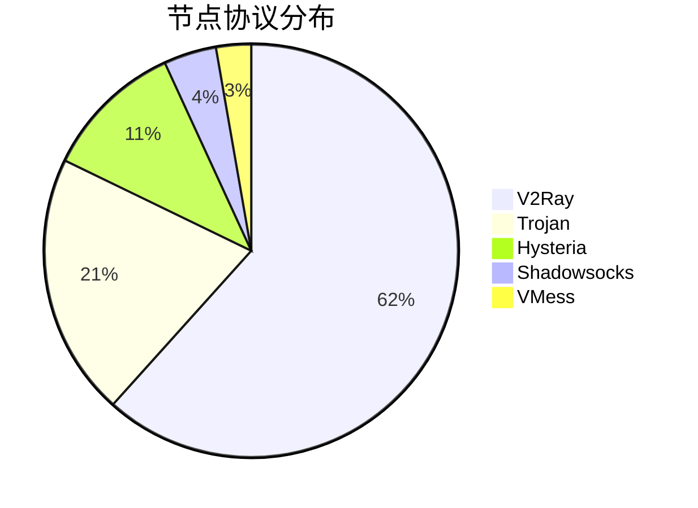

# 🌐 代理节点订阅管理工具

[](LICENSE)
[](https://www.microsoft.com/windows)
[]()

> 一个功能强大的代理节点订阅管理工具，支持多种协议格式转换和节点管理

## 📋 目录

- [项目介绍](#项目介绍)
- [功能特性](#功能特性)
- [快速开始](#快速开始)
- [节点信息](#节点信息)
- [配置说明](#配置说明)
- [使用说明](#使用说明)
- [文件结构](#文件结构)
- [技术栈](#技术栈)
- [贡献指南](#贡献指南)
- [许可证](#许可证)

## 🎯 项目介绍

本项目是一个专业的代理节点订阅管理工具，主要用于：

- 🔄 **格式转换**: 支持多种代理协议格式之间的转换
- 📊 **节点管理**: 提供节点信息查看、测试和管理功能
- 🛠️ **配置生成**: 自动生成各种客户端配置文件
- 📈 **性能监控**: 实时监控节点连接状态和速度

## ✨ 功能特性

- 🚀 **多协议支持**: 支持 Shadowsocks、V2Ray、Trojan、Hysteria 等多种协议
- 🔧 **自动转换**: 一键转换不同格式的配置文件
- 📱 **跨平台**: 支持 Windows 平台运行
- 🎨 **图形界面**: 提供友好的图形用户界面
- 📊 **实时监控**: 实时显示节点状态和连接信息
- 🔒 **安全可靠**: 支持加密传输和证书验证

## 🚀 快速开始

### 系统要求

- Windows 10/11 (64位)
- .NET Framework 4.7.2 或更高版本
- 至少 100MB 可用磁盘空间

### 安装步骤

1. **下载程序**
   ```bash
   # 下载最新版本
   git clone https://github.com/your-username/cmliu.git
   cd cmliu
   ```

2. **运行程序**
   ```bash
   # 直接运行可执行文件
   ./subs-check.win.gui.exe
   ```

3. **配置节点**
   - 打开程序后，选择 `output` 文件夹中的配置文件
   - 选择 `mihomo.yaml` 或 `base64.txt` 作为节点源
   - 点击开始转换或测试

## 📡 节点信息

### 当前可用节点

| 地区 | 数量 | 协议类型 | 平均速度 |
|------|------|----------|----------|
| 🇺🇸 美国 | 30+ | V2Ray/Trojan | 2.5MB/s |
| 🇯🇵 日本 | 2 | Shadowsocks | 1.8MB/s |
| 🇸🇬 新加坡 | 3 | V2Ray | 1.6MB/s |
| 🇩🇪 德国 | 14 | V2Ray | 2.2MB/s |
| 🇫🇷 法国 | 5 | V2Ray/Trojan | 2.1MB/s |
| 🇬🇧 英国 | 4 | V2Ray | 2.8MB/s |
| 🇳🇱 荷兰 | 3 | Hysteria | 2.3MB/s |
| 🇷🇺 俄罗斯 | 3 | Hysteria2 | 3.2MB/s |

### 节点协议分布



## ⚙️ 配置说明

### 主要配置文件

- **`output/mihomo.yaml`**: Mihomo 客户端配置文件
- **`output/base64.txt`**: Base64 编码的节点订阅链接
- **`output/all.yaml`**: 完整的节点配置文件
- **`output/ACL4SSR_Online_Full.yaml`**: ACL4SSR 规则配置

### 配置示例

```yaml
# Mihomo 配置示例
proxies:
  - name: "🇺🇸 美国节点"
    type: vless
    server: 104.21.71.131
    port: 443
    uuid: your-uuid-here
    network: ws
    tls: true
    ws-opts:
      path: /path
      headers:
        Host: example.com
```

## 📖 使用说明

### 基本操作

1. **导入节点**
   - 点击"导入"按钮
   - 选择节点文件或输入订阅链接
   - 系统自动解析并显示节点列表

2. **测试节点**
   - 选择要测试的节点
   - 点击"测试"按钮
   - 查看延迟和速度结果

3. **导出配置**
   - 选择目标格式
   - 点击"导出"按钮
   - 保存配置文件到指定位置

### 高级功能

- **批量操作**: 支持批量测试和导出
- **规则配置**: 自定义分流规则
- **自动更新**: 定时更新节点信息
- **日志记录**: 详细的操作日志

## 📁 文件结构

```
cmliu/
├── README.md                 # 项目说明文档
├── subs-check.win.gui.exe    # 主程序文件
├── subs-check.exe           # 命令行版本
├── config/                  # 配置文件目录
├── output/                  # 输出文件目录
│   ├── mihomo.yaml         # Mihomo 配置
│   ├── base64.txt          # Base64 节点
│   ├── all.yaml            # 完整配置
│   └── ACL4SSR_Online_Full.yaml
├── YamlDotNet.dll          # YAML 处理库
├── Newtonsoft.Json.dll     # JSON 处理库
└── Upgrade.exe             # 更新程序
```

## 🛠️ 技术栈

- **开发语言**: C# (.NET Framework)
- **UI框架**: Windows Forms
- **配置文件**: YAML, JSON
- **网络协议**: HTTP/HTTPS, WebSocket
- **加密算法**: AES, ChaCha20, RSA

## 🤝 贡献指南

我们欢迎所有形式的贡献！

### 如何贡献

1. Fork 本仓库
2. 创建特性分支 (`git checkout -b feature/AmazingFeature`)
3. 提交更改 (`git commit -m 'Add some AmazingFeature'`)
4. 推送到分支 (`git push origin feature/AmazingFeature`)
5. 开启 Pull Request

### 贡献类型

- 🐛 Bug 修复
- ✨ 新功能开发
- 📝 文档改进
- 🎨 界面优化
- ⚡ 性能提升

## 📄 许可证

本项目采用 MIT 许可证 - 查看 [LICENSE](LICENSE) 文件了解详情。

## 📞 联系我们

- **项目地址**: [GitHub Repository](https://github.com/your-username/cmliu)
- **问题反馈**: [Issues](https://github.com/your-username/cmliu/issues)
- **讨论交流**: [Discussions](https://github.com/your-username/cmliu/discussions)

## 🙏 致谢

感谢所有为这个项目做出贡献的开发者和用户！

---

<div align="center">

**如果这个项目对您有帮助，请给个 ⭐ Star 支持一下！**

[](https://github.com/your-username/cmliu)
[](https://github.com/your-username/cmliu)

</div> 